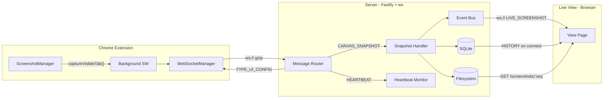
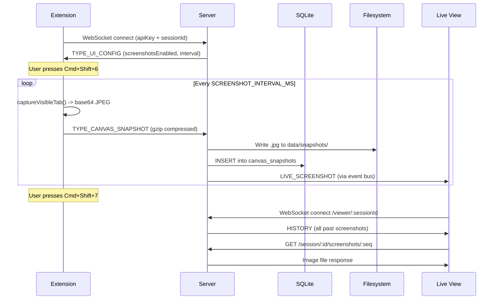

# ChromaBridge — Screenshot Capture & Replay

A monorepo containing a **WebSocket ingestion server** and a **Chrome extension** for capturing periodic screenshots of any web page, streaming them to the server in real time, and viewing them through a live session replay interface.

## Architecture

### Data Flow



### Request Flow



## Project Structure

```
flux-ui-adapter/
├── package.json                  # npm workspaces root
├── server/
│   ├── src/
│   │   ├── server.ts             # Entry point
│   │   ├── app.ts                # Fastify composition
│   │   ├── config.ts             # Env-driven config
│   │   ├── schemas/messages.ts   # Zod schemas + binary header parser
│   │   ├── handlers/
│   │   │   └── canvas-snapshot.handler.ts
│   │   ├── middleware/
│   │   │   ├── decompress.ts     # Gzip / raw deflate
│   │   │   └── validate.ts       # Zod validation
│   │   ├── storage/
│   │   │   ├── sqlite.ts         # Sessions + canvas_snapshots tables
│   │   │   ├── file-store.ts     # Disk writes for images
│   │   │   └── flush-worker.ts   # Async archival
│   │   ├── ws/
│   │   │   ├── upgrade.ts        # Auth + WebSocket upgrade
│   │   │   ├── connection.ts     # Per-connection lifecycle
│   │   │   ├── router.ts         # Message type dispatch
│   │   │   ├── heartbeat.ts      # Ping/pong timeout
│   │   │   └── viewer.ts         # Live view WebSocket
│   │   ├── routes/
│   │   │   ├── health.ts
│   │   │   ├── landing.ts        # Stealth cover page
│   │   │   ├── sessions-list.ts  # GET /sessions
│   │   │   ├── session-view.ts   # GET /session/:id/view
│   │   │   └── screenshots.ts    # GET /session/:id/screenshots/:seq
│   │   └── lib/
│   │       ├── logger.ts         # Pino structured logging
│   │       └── event-bus.ts      # In-memory screenshot broadcast
│   ├── tests/
│   │   ├── unit/
│   │   │   └── message-parser.test.ts
│   │   └── integration/
│   │       ├── ws-handshake.test.ts
│   │       └── ws-ingestion.test.ts
│   ├── public/index.html         # ChromaBridge API docs (cover)
│   ├── .env.example
│   ├── package.json
│   ├── tsconfig.json
│   └── vitest.config.ts
└── extension/
    ├── src/
    │   ├── background.ts         # Service worker entry
    │   ├── screenshot-manager.ts # captureVisibleTab interval
    │   ├── ws-manager.ts         # WebSocket + reconnect + gzip
    │   └── types.ts              # Shared interfaces
    ├── manifest.json             # Manifest V3
    ├── package.json
    └── tsconfig.json
```

## Quick Start

### 1. Install dependencies

```bash
npm install
```

### 2. Configure the server

```bash
cp server/.env.example server/.env
# Edit server/.env — set API_KEY, SCREENSHOTS_ENABLED=true, etc.
```

### 3. Start the server

```bash
npm run dev --workspace=server
```

### 4. Build the extension

```bash
npm run build --workspace=extension
```

### 5. Load the extension in Chrome

1. Go to `chrome://extensions`
2. Enable **Developer mode**
3. Click **Load unpacked** and select the `extension/` directory
4. The service worker will connect to `ws://localhost:3000`

### 6. Capture screenshots

- Press **Cmd+Shift+6** (Mac) / **Ctrl+Shift+6** (Win/Linux) to start
- Press **Cmd+Shift+7** / **Ctrl+Shift+7** to stop
- Screenshots are captured at the interval set in `.env` (`SCREENSHOT_INTERVAL_MS`)

### 7. View sessions

- Open **http://localhost:3000/sessions** to see all sessions
- Click **Open View** on any session to see the live screenshot stream
- Click any thumbnail for a full-size lightbox view

## Environment Variables

| Variable | Default | Description |
|---|---|---|
| `PORT` | `3000` | Server port |
| `HOST` | `0.0.0.0` | Bind address |
| `API_KEY` | `change-me-...` | WebSocket auth key |
| `DB_PATH` | `./data/flux.db` | SQLite database path |
| `SNAPSHOTS_DIR` | `./data/snapshots` | Screenshot storage directory |
| `FLUSH_INTERVAL_MS` | `60000` | Archive check interval |
| `HEARTBEAT_INTERVAL_MS` | `15000` | Heartbeat ping interval |
| `HEARTBEAT_TIMEOUT_MS` | `30000` | Disconnect after no heartbeat |
| `LOG_LEVEL` | `info` | Pino log level |
| `SCREENSHOTS_ENABLED` | `false` | Enable screenshot capture |
| `SCREENSHOT_INTERVAL_MS` | `10000` | Capture interval in ms |

## Message Types

| Type | Direction | Description |
|---|---|---|
| `TYPE_CANVAS_SNAPSHOT` | Extension -> Server | Screenshot (base64 JPEG or binary) |
| `TYPE_HEARTBEAT` | Extension -> Server | Keep-alive ping |
| `TYPE_UI_CONFIG` | Server -> Extension | Capture settings, theme updates |

## Running Tests

```bash
npm run test --workspace=server
```

## Tech Stack

| Component | Technology |
|---|---|
| Runtime | Node.js v20+ |
| Server | Fastify v5 |
| WebSocket | ws v8 |
| Database | SQLite (better-sqlite3, WAL mode) |
| Validation | Zod v3 |
| Logging | Pino v9 |
| Extension | Chrome Manifest V3 |
| Compression | fflate (extension), zlib (server) |
| Testing | Vitest v2 |
